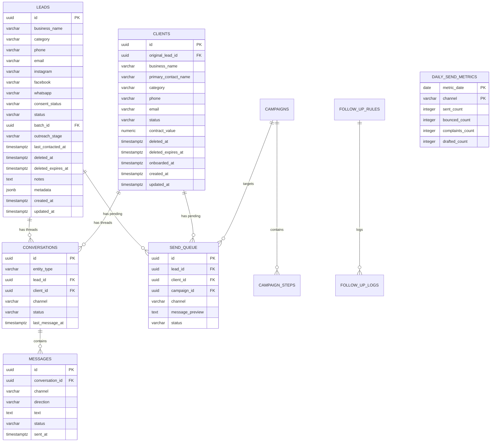

# AI Client Follow-Up & Lead Outreach System

[](https://reactjs.org/)
[](https://vitejs.dev/)
[](https://www.typescriptlang.org/)
[](https://tailwindcss.com/)
[](https://expressjs.com/)
[](https://www.postgresql.org/)
[](https://ollama.com/)

An omni-channel cold outreach and lead relationship management (CRM) platform designed for agency owners, growth teams, and sales professionals. It connects bulk lead ingestion, multi-touch drip sequencing, omni-channel engagement (Email, WhatsApp, Instagram/Facebook), and pipeline conversion tracking into a unified, responsive dashboard.

---

## 1. Core Architectural Mandate

> [!IMPORTANT]
> **Separation of Services Rule**:
> The **Outreach Engine** and the **Conversation Orchestrator** operate as completely decoupled services. 
> A cold **lead** is NEVER messaged by the same automatic, unlimited-reply logic used for paying **clients**.

```
┌────────────────────────────────────────────────────────┐
│                   Bolt.new Frontend                    │
│   (Import Leads, Campaigns, CRM / Inbox, Health)       │
└──────────────────────────┬─────────────────────────────┘
                           │ HTTP / REST (/api via Vite proxy)
┌──────────────────────────▼─────────────────────────────┐
│             Node.js / Express TypeScript API           │
│                                                        │
│  ┌─────────────────────────┐ ┌──────────────────────┐  │
│  │     Outreach Engine     │ │     Conversation     │  │
│  │ (Cold sequence drip,    │ │     Orchestrator     │  │
│  │  consent gate, hard     │ │ (Client onboarding,  │  │
│  │  suppression, limits)   │ │  retention, check-in)│  │
│  └───────────┬─────────────┘ └──────────┬───────────┘  │
│              │                          │              │
│  ┌───────────┴──────────────────────────┴───────────┐  │
│  │              Channel-Aware Send Router           │  │
│  │   • Email: Direct Send (Warm-up throttled)       │  │
│  │   • WhatsApp: Inbound only (Cold send disabled)  │  │
│  │   • Instagram/FB: Draft queue (Human approved)   │  │
│  └───────────────────────┬──────────────────────────┘  │
│                          │                             │
│  ┌───────────────────────▼──────────────────────────┐  │
│  │           Local Ollama LLM Inference             │  │
│  │     (Llama 3.1 8B / Mistral 7B via localhost)    │  │
│  └──────────────────────────────────────────────────┘  │
└──────────────────────────┬─────────────────────────────┘
                           │
┌──────────────────────────▼─────────────────────────────┐
│                 PostgreSQL Relational DB               │
│                                                        │
│  • leads (consent_status: none, replied, opted_out)    │
│  • clients (separate table: active paying accounts)    │
│  • conversations (thread tracking per entity)          │
│  • messages (omni-channel transcripts & status)        │
│  • follow_up_rules (scheduler & frequency policies)    │
│  • follow_up_logs (audit trail of automated triggers)  │
│  • send_queue (approval queue for human dispatch)      │
│  • daily_send_metrics (deliverability & health)        │
└────────────────────────────────────────────────────────┘
```

---

## 2. Core Features

### 2.1 Lead Ingestion & Data Cleansing Engine
* **Dual Ingestion Modes (Single Form & Bulk Import)**: The Lead Ingestion interface provides a clean, tabbed layout enabling both manual single lead creation and mass CSV/spreadsheet parsing.
* **Single Lead Registration Form**:
  * **Company Profile**: Business Name (required) and Industry/Category with smart datalist suggestions.
  * **Omni-Channel Contact Details**: Dedicated fields for Email Address, Phone Number, WhatsApp Number, Instagram Handle (auto-formats `@handle`), and Facebook Profile/Page URL.
  * **Real-Time Duplicate Warning**: Inline amber warning instantly flags if the typed email already belongs to an active lead or client in PostgreSQL.
  * **Pipeline Status & List Assignment**: Configure initial status as `Active` (ready for outreach) or `Inactive` (parked), assign directly to a Custom List, and set a custom Source/Batch Tag.
  * **Contextual Outreach Notes**: Multi-line textarea for meeting summaries, account research, or specific outreach triggers.
  * **One-Click Sample Data & Reset**: Rapidly populate realistic test data or clear fields with a single click.
  * **Direct CRM Navigation**: Instant feedback card with a direct "View in CRM" button upon saving.
* **Bulk CSV & Raw Text Ingestion**:
  * **Pasted Text & CSV Parsing**: Robust parsing with automatic header detection (`business_name`, `category`, `phone`, `email`, `instagram`, `facebook`, `whatsapp`), quote escaping, and whitespace trimming.
  * **Dual-Table Deduplication**: Deduplicates records against **both** the `leads` table and the `clients` table (by normalized email and normalized phone digits).
  * **Intra-Batch Deduplication**: Prevents duplicate records within the same uploaded file or pasted text.
  * **Incomplete Row Flagging**: Automatically flags rows missing all contact channels (`email`, `phone`, `instagram`, `facebook`, `whatsapp`) and excludes them from import.
  * **Atomic PostgreSQL Insertion**: Bulk commits valid records via `POST /api/leads/import` with 28-day batch expiration tracking.

### 2.2 Multi-Channel Campaign & Sequence Builder
* **Multi-Touch Drip Sequences**: Configure multi-step outreach with step names, channel selectors, and customizable delay days.
* **Audience Segmentation**: Filter and preview target audiences dynamically by category and channel capabilities.
* **Local AI Assistant**: Generate persuasive cold outreach copy using local Ollama LLMs (`Llama 3.1 8B` or `Mistral 7B`) directly inside each sequence step.
* **PostgreSQL Persistence**: Saves campaigns and sequence steps directly to the database via `POST /api/campaigns`.

### 2.3 Unified Leads & Clients CRM (Phase 5)
* **Single-Entity Invariant**: A contact strictly exists in `leads` OR `clients`, never both simultaneously. Once a lead replies positively or is converted to a client, the record is removed from `leads` and all message history is preserved under `clients`.
* **Lead Selection & Bulk Actions**: Select individual leads with row checkboxes, multiple leads, or click the header checkbox for "Select All". A floating bulk action bar allows 1-click "Delete Selected" or "Save to List / Save for Later".
* **Custom Lists Management**: Create, view, and delete organized outreach lists (e.g. *"High Priority Hot Leads"*, *"Follow-up in October"*). Filter CRM leads by list dynamically with automatic count badges.
* **Real Conversation Timeline**: Dynamic multi-channel transcripts loaded from `/api/conversations/by-lead/:id` or `/api/conversations/by-client/:id`.
* **Automated Lead $\rightarrow$ Client Conversion**: On inbound reply, the contact is converted to `'active'` client status, existing conversations are transferred to `client_id`, and the contact is purged from `leads`.
* **Orchestrator Follow-Up Scheduler**: Converted clients are automatically enrolled in active retention rules (e.g. *"Bi-Weekly Health Check-in"*), generating scheduled tasks in `follow_up_logs`.
* **Cold Queue Purge**: Converting a lead immediately discards any pending cold outreach drafts in `send_queue`.
* **Interactive Inbound Simulator**: Built-in simulator to test inbound replies (positive reply conversion vs. opt-out suppression) directly in the UI.

### 2.4 Channel-Aware Send Router & Inbound Email Sync (Phase 3, Phase 4 & Phase 10)
* **Outbound Email Delivery via Gmail SMTP**: Direct Gmail integration (`smtp.gmail.com:465`) with 16-character Google App Passwords allowing live external email delivery without requiring a custom domain or web hosting.
* **Automated Inbound Reply Reflection (Gmail IMAP Listener)**:
  * **Real-Time Inbox Ingestion**: Connects to `imap.gmail.com:993` (SSL) via `imapflow` and `mailparser` to automatically fetch external email replies received in the Gmail inbox.
  * **Clean Message Extraction**: Automatically isolates the recipient's new reply text from email quote trees and historical forward headers (`On ... wrote:`, `From: ...`, `>`).
  * **Lead & Client Matching**: Matches the reply's sender address to active contacts in PostgreSQL, updates lead `consent_status` to `'replied'`, updates `last_contacted_at`, and attaches the inbound message to the conversation timeline.
  * **Automated Background Polling & Manual Sync**: Periodically polls Gmail every 30 seconds in the background and provides an explicit **"Sync Email Replies"** button in the CRM header and **"Check Gmail Replies"** in the contact conversation modal for on-demand synchronization.
  * **Automatic Bounce Detection**: Analyzes delivery status failure notifications from `mailer-daemon@googlemail.com` and records bounces into `daily_send_metrics` for real deliverability tracking.
* **WhatsApp Adapter**: Outbound cold sending is strictly disabled (`COLD_OUTBOUND_DISALLOWED`). Outbound messages are permitted **only within an active 24-hour customer service window** initiated by an inbound message.
* **Instagram / Facebook Adapter**: "Draft, needs human send" queue workflow creating pending drafts in `send_queue` with direct profile deep-links to prevent Meta platform automation shadowbans.
* **Unified Send Router**: Pre-flight dispatch routing enforces consent checks, warm-up velocity, and channel policies before any message is transmitted.

### 2.5 Hard Suppression & Consent Gate (Phase 6)
* **Pre-Send Hard Gate**: Blocks any outbound dispatch to contacts with `consent_status = 'opted_out'`.
* **Global Suppression Register**: Cross-references recipient normalized email and phone digits against all suppressed records in the database, preventing re-messaging across different imports or campaigns.
* **Keyword Listener**: Inbound messages containing keywords (`stop`, `unsubscribe`, `remove`, `cancel`, `quit`, `opt out`, `dont message`, `do not contact`) immediately update `consent_status` to `'opted_out'`, discard pending drafts, and halt any conversion to Client.

### 2.6 Sending Health & Deliverability Center (Phase 7)
* **7-Day Activity Chart**: Tracks daily sent volume vs. bounces vs. spam complaints in PostgreSQL.
* **Spam Complaint Signal Monitoring**: Continuously tracks spam complaint rates aligned with Google & Yahoo 2024 sender requirements ($< 0.1\%$ Safe, $> 0.3\%$ Critical).
* **Deliverability Auto-Throttling Engine**: Automatically halts automated cold sends (`isAutoThrottled: true`) if the bounce rate $> 5.0\%$, the spam complaint rate $> 0.30\%$, or the daily warm-up limit is reached.
* **Deliverability Signal Simulator**: Interactive simulator allowing teams to inject test bounces, spam complaints, or volume sends to observe live auto-throttling and test baseline recovery.
* **Manual Send Approval Queue**: 1-click "Mark as Sent" and "Discard" actions with live queue clearance for Instagram/Facebook drafts.
* **System Infrastructure Status**: Real-time status indicators for PostgreSQL connection and local Ollama daemon.

### 2.7 28-Day Deletion Retention & Trash Restoration (Phase 8)
* **Soft-Deletion with Expiration**: Deleted leads are preserved for a rolling 28-day restoration window (`deleted_at = NOW(), deleted_expires_at = NOW() + INTERVAL '28 days'`), completely hidden from the active CRM table but never prematurely lost.
* **Audit Trail & Deletion History**: All deletion operations log full snapshot records to `deletion_history` with entity ID, contact data, deletion timestamp, and expiration.
* **Interactive 28-Day Trash Modal**: Dedicated trash browser in the CRM showing each soft-deleted contact, days remaining before purge, single-click "Restore", bulk restoration, and permanent purge.
* **Full History Preservation**: Restoring a lead immediately returns it to the active pipeline with all previous conversations, channel transcripts, and touches 100% intact.

### 2.8 Upload Batches & 1-Click Batch Email Shooting (Phase 8)
* **28-Day Upload Batch Tracking**: Each lead import (CSV or paste) creates an immutable `upload_batches` record with custom batch name, source, total row counts, imported count, duplicate count, incomplete count, and `expires_at = NOW() + INTERVAL '28 days'`.
* **CRM Batch Filtering**: Filter the CRM table by specific upload batch to instantly view and manage contacts from that particular campaign or list ingestion.
* **1-Click "Shoot Emails to this Batch"**: Click the batch action button in the CRM banner to automatically shoot personalized, stage-appropriate cold emails to every eligible contact in that batch in one click.

### 2.9 Condition-Based Automated Sequence Dispatch (Phase 8)
* **Automatic Stage Detection**: The system dynamically inspects each contact's interaction history to determine their exact sequence condition:
  * **0 outbound emails sent** $\rightarrow$ `initial` (**First Message Needed** / Intro copy)
  * **1 outbound email sent** $\rightarrow$ `followup_1` (**Follow-up 1 Due** / Check-in copy)
  * **2 outbound emails sent** $\rightarrow$ `followup_2` (**Follow-up 2 Due** / Final nudge copy)
  * **$\ge 3$ outbound emails sent** $\rightarrow$ `completed` (**Sequence Completed** / Automated skip)
* **Smart Safety Exclusions**: Contacts with `consent_status = 'opted_out'` or `'replied'`, or those missing a valid email address are automatically skipped with detailed explanations.
* **Bulk & Single Auto-Send**:
  * **Bulk Selection**: Select any combination of leads (or "Select All") and click **"⚡ Auto-Send Next Step"** in the floating action bar to dispatch appropriate copy to each lead simultaneously.
  * **Single Lead Preview**: Open any lead modal and click **"⚡ Shoot Next Step Automatically"** to preview the exact stage, personalized subject line, and body before sending.

### 2.10 Comprehensive Client Info Editing (Admin CRM)
* **Full In-Place Client Updates**: Admins can open any converted client modal and click **"✏️ Edit Info"** to update business name, primary contact name, category, phone, email, Instagram, Facebook, WhatsApp, status (`active`, `paused`, `churned`), contract value, and internal notes.
* **PostgreSQL Persistence**: Updates are committed via `PUT /api/clients/:id` with real-time UI synchronization across the CRM.

### 2.11 Lead & Active Client Deletion Synchronization & Trash Management (Phase 9)
* **Cross-Entity Soft-Deletion**: Deleting a lead (single, row action, or bulk) automatically soft-deletes the lead and any matching record in `clients` (by `original_lead_id` or matching email), moving both to Trash with a rolling 28-day retention window.
* **Bidirectional Client Soft-Deletion**: Deleting a client (`DELETE /api/clients/:id`) soft-deletes the client and any corresponding lead record, preserving both in Trash for 28 days with zero history loss.
* **Unified Active Exclusion**: Active lists (`GET /api/leads` and `GET /api/clients`) enforce `WHERE deleted_at IS NULL`, guaranteeing that soft-deleted contacts never appear in active CRM views.
* **Interactive Trash with Empty Trash & Multi-Purge**:
  * **Clear Trash at Once**: Click **"Clear Trash ({count})"** (`POST /api/leads/trash/clear`) to permanently empty all soft-deleted records and foreign keys at once.
  * **Multi-Select & Bulk Permanent Delete**: Select multiple records in Trash view and click **"Permanently Delete ({count})"** (`POST /api/leads/trash/bulk-permanent-delete`).
  * **Single Purge**: Purge records one-by-one (`DELETE /api/leads/:id/permanent`).
  * **Restoration**: Restoring any contact restores both lead and client records back to active CRM (`POST /api/leads/:id/restore` and `POST /api/leads/bulk-restore`).

### 2.12 Mark as Inactive Option & Status Filtering (Phase 9)
* **Status Column & Interactive Toggle**: Every lead and client displays an interactive status pill (`Active` / `Inactive`) that can be clicked directly to toggle status.
* **Row-Level Action Buttons**: Each CRM row provides dedicated **"Activate" / "Inactive"** toggle buttons alongside the Delete button.
* **Bulk Status Update**: Select 1, multiple, or all leads and click **"Mark Inactive"** or **"Mark Active"** in the floating bulk action bar (`POST /api/leads/bulk-status`).
* **Detail Modal Status Management**: The lead and client detail modal displays the current status and features a toggle button to switch between Active and Inactive.
* **CRM Status Filtering**: Filter CRM records by status (`All Status`, `Active Only`, `Inactive Only`) in the filter strip.

---

## 3. Database Schema (PostgreSQL 16)



---

## 4. API Reference

| Method | Endpoint | Description |
| :--- | :--- | :--- |
| `GET` | `/api` | Service operational health check |
| `GET` | `/api/leads` | List leads (supports `consent`, `category`, `search` filters) |
| `GET` | `/api/leads/:id` | Get single lead by ID |
| `POST` | `/api/leads` | Create single lead |
| `POST` | `/api/leads/import` | Bulk import with multi-table deduplication & validation |
| `PATCH`| `/api/leads/:id/consent` | Update lead consent status (`none`, `replied`, `opted_out`) |
| `PATCH`| `/api/leads/:id/status` | Mark lead as `active`, `inactive`, or `paused` |
| `POST` | `/api/leads/bulk-status` | Bulk update status for multiple leads (`active`, `inactive`) |
| `DELETE`| `/api/leads/:id` | Soft-delete lead & matching client (moves to Trash for 28 days) |
| `POST` | `/api/leads/bulk-delete` | Bulk soft-delete leads & matching clients (28-day retention) |
| `GET` | `/api/leads/trash` | List soft-deleted leads & clients preserved within 28-day window |
| `POST` | `/api/leads/:id/restore` | Restore soft-deleted lead & matching client to active CRM |
| `POST` | `/api/leads/bulk-restore` | Bulk restore soft-deleted leads & clients to active CRM |
| `DELETE`| `/api/leads/:id/permanent` | Permanently purge lead & matching client from database |
| `POST` | `/api/leads/trash/bulk-permanent-delete` | Permanently purge selected trash leads & clients |
| `POST` | `/api/leads/trash/clear` | Empty / clear all records in trash permanently at once |
| `GET` | `/api/clients` | List paying clients (filters out soft-deleted records) |
| `GET` | `/api/clients/:id` | Get single client by ID |
| `POST` | `/api/clients/convert` | Promote lead to client and enroll in Conversation Orchestrator |
| `PUT` | `/api/clients/:id` | Update full client information (business, contacts, notes, value) |
| `PATCH`| `/api/clients/:id/status` | Update client status (`active`, `paused`, `churned`) |
| `DELETE`| `/api/clients/:id` | Soft-delete client & matching lead (moves to Trash for 28 days) |
| `GET` | `/api/batches` | List 28-day upload batches with remaining days and stats |
| `POST` | `/api/batches/:id/shoot-emails` | 1-click batch sequence email dispatch via Gmail SMTP |
| `GET` | `/api/conversations/by-lead/:leadId` | Get message history for a lead |
| `GET` | `/api/conversations/by-client/:clientId` | Get message history for a client |
| `POST` | `/api/conversations/reply` | Send message (enforces Channel Router for cold leads) |
| `POST` | `/api/conversations/inbound` | Inbound reply receiver, opt-out suppression & client auto-conversion |
| `POST` | `/api/conversations/auto-send-next` | Condition-based automated sequence message dispatcher |
| `GET` | `/api/conversations/stage/:leadId` | Inspect contact sequence stage and next step copy |
| `GET` | `/api/campaigns` | List campaigns with sequence steps |
| `POST` | `/api/campaigns` | Create campaign and sequence steps |
| `GET` | `/api/queue` | List manual send queue drafts |
| `POST` | `/api/queue/:id/send` | Mark queue draft as sent and log message |
| `POST` | `/api/queue/:id/discard` | Discard queue draft |
| `GET` | `/api/health` | Deliverability metrics, spam signals, warmup limits & system status |
| `POST` | `/api/health/signal` | Inject deliverability event signal (bounce, spam complaint, sent) |
| `POST` | `/api/health/reset-today` | Reset today's deliverability test signals back to baseline |
| `GET` | `/api/adapters/email/warmup` | Get dedicated subdomain SPF/DKIM/DMARC status & warm-up stage |
| `POST` | `/api/adapters/email/stage` | Update progressive email warm-up stage (1-5) |
| `POST` | `/api/adapters/email/subdomain` | Configure dedicated outreach subdomain |
| `GET` | `/api/adapters/whatsapp/window/:id` | Check 24-hour customer service window status for a contact |
| `POST` | `/api/adapters/whatsapp/webhook` | WhatsApp webhook simulator & receiver |
| `GET` | `/api/ai/status` | Check local Ollama daemon & model availability |
| `POST` | `/api/ai/draft` | Generate AI cold outreach draft via Ollama |

---

## 5. Getting Started

### Prerequisites
* **Node.js**: v18+ (tested on Node v24)
* **PostgreSQL**: PostgreSQL 16+ running locally on port `5432`
* **Ollama (Optional)**: For local AI draft generation (`ollama serve`)

### Setup Instructions

1. **Clone the Repository**:
   ```bash
   git clone https://github.com/helloujjawal007/Outreach-Dashboard.git
   cd Outreach-Dashboard
   ```

2. **Install Dependencies**:
   ```bash
   npm install
   ```

3. **Configure Environment Variables**:
   Copy `.env.example` to `.env` and configure your database credentials:
   ```bash
   cp .env.example .env
   ```
   Example configuration:
   ```env
   PORT=5001
   NODE_ENV=development
   DATABASE_URL=postgresql://localhost:5432/outreach_dashboard
   PGUSER=your_postgres_user
   PGPORT=5432
   PGDATABASE=outreach_dashboard
   OLLAMA_BASE_URL=http://localhost:11434
   OLLAMA_MODEL=llama3.1:8b
   ```

4. **Run Database Migrations & Seed**:
   ```bash
   npm run db:migrate   # Creates tables, enums, triggers, indexes
   npm run db:seed      # Seeds initial sample leads, clients, campaigns, metrics
   ```

5. **Start the Application**:
   ```bash
   npm run dev
   ```
   This concurrently launches:
   * **Vite Client**: `http://localhost:5173`
   * **Express Backend**: `http://localhost:5001` (proxied via Vite `/api`)

---

## 6. Project Structure

```
Outreach-Dashboard/
├── server/
│   ├── src/
│   │   ├── adapters/
│   │   │   ├── emailAdapter.ts     # Dedicated subdomain SPF/DKIM/DMARC & progressive warm-up
│   │   │   ├── whatsappAdapter.ts  # 24h inbound window enforcement & webhook receiver
│   │   │   └── instagramAdapter.ts # "Draft, needs human send" queue with deep-links
│   │   ├── config/
│   │   │   ├── db.ts               # PostgreSQL connection pool & helpers
│   │   │   └── env.ts              # Typed environment variables
│   │   ├── db/
│   │   │   ├── schema.sql          # PostgreSQL DDL migrations
│   │   │   ├── seed.sql            # Initial sample seed records
│   │   │   ├── migrate.ts          # Migration runner
│   │   │   └── seed.ts             # Seed runner
│   │   ├── routes/
│   │   │   ├── leads.ts            # /api/leads CRUD & bulk import
│   │   │   ├── clients.ts          # /api/clients & conversion
│   │   │   ├── conversations.ts    # /api/conversations & inbound simulator
│   │   │   ├── campaigns.ts        # /api/campaigns & sequence steps
│   │   │   ├── queue.ts            # /api/queue manual approval
│   │   │   ├── health.ts           # /api/health deliverability metrics
│   │   │   ├── ai.ts               # /api/ai Ollama draft generator
│   │   │   └── adapters.ts         # /api/adapters email warmup & WhatsApp window endpoints
│   │   ├── services/
│   │   │   ├── outreachService.ts  # Outreach Engine (cold leads & consent gate router)
│   │   │   ├── orchestratorService.ts # Conversation Orchestrator (clients)
│   │   │   └── ollamaService.ts    # Local Ollama LLM integration
│   │   └── index.ts                # Express server entrypoint
│   └── tsconfig.json
├── src/
│   ├── components/                 # Sidebar, Modal, Badge, ChannelIcon
│   ├── pages/
│   │   ├── LeadImportPage.tsx      # Real CSV/text import & deduplication
│   │   ├── CampaignBuilderPage.tsx # Multi-channel sequence builder + AI
│   │   ├── CrmPage.tsx             # Leads & Clients CRM + conversation timeline & channel router
│   │   └── SendingHealthPage.tsx   # Deliverability metrics, warm-up status, & send queue
│   ├── services/
│   │   └── api.ts                  # Typed frontend API client & adapter endpoints
│   ├── utils/
│   │   └── parseImport.ts          # Multi-table and intra-batch dedupe parser
│   ├── store.ts                    # Live state store wired to PostgreSQL
│   ├── types.ts                    # TypeScript data models
│   ├── App.tsx                     # Main layout & router
│   └── main.tsx                    # React DOM entrypoint
├── .env.example                    # Environment variable template
├── package.json                    # Scripts & dependencies
├── tailwind.config.js              # Styling theme
└── vite.config.ts                  # Vite config with /api reverse proxy
```

---

## 7. Phased Roadmap Status

- [x] **Phase 0: Environment & Backend Setup**
  - Node.js/Express TypeScript backend structure.
  - PostgreSQL connection pool configured.
  - Local Ollama LLM integration module with fallback handling.
- [x] **Phase 1: Data Model & PostgreSQL Schema**
  - Strict table separation (`leads` vs `clients`).
  - Added `consent_status` (`none`, `replied`, `opted_out`).
  - Full relational schema: `conversations`, `messages`, `follow_up_rules`, `follow_up_logs`, `campaigns`, `campaign_steps`, `send_queue`, `daily_send_metrics`.
- [x] **Phase 2: UI & Data Wiring**
  - Bolt frontend connected to real backend API endpoints via Vite proxy.
  - Real CSV/paste import with multi-table and intra-batch deduplication.
  - Live CRM detail, quick reply via Channel Router, and Lead $\rightarrow$ Client conversion.
- [x] **Phase 3: Channel Adapters**
  - Email adapter: Dedicated subdomain verification (SPF, DKIM, DMARC) + 5-stage progressive warm-up tracker.
  - WhatsApp adapter: Inbound reply handling only (strict 24-hour customer service window). Cold-send disabled by policy.
  - Instagram/Facebook adapter: "Draft, needs human send" queue workflow creating actionable pending drafts with direct profile links.
- [x] **Phase 4: Channel-Aware Send Router**
  - Channel-aware routing logic: Direct email dispatch, draft queuing for Instagram/FB, policy gating for cold WhatsApp.
  - Rate-limiting & warm-up auto-throttling against `daily_send_metrics`.
  - Hard consent gate blocking any dispatch to opted-out contacts.
- [x] **Phase 5: Inbound Reply Detection & Lead -> Client Conversion**
  - Inbound reply detector: automatically updates `leads.consent_status = 'replied'`.
  - Automatic conversion: creates full `clients` row in PostgreSQL with status `'active'`.
  - Conversation Orchestrator hand-off: automatically enrolls converted clients in `follow_up_rules` (e.g. Bi-Weekly Health Check-in) and creates initial task in `follow_up_logs`.
  - Cold queue cancellation: automatically purges pending cold drafts in `send_queue` for converted leads.
- [x] **Phase 6: Hard Suppression & Consent Gate**
  - Robust keyword parser: catches `stop`, `unsubscribe`, `remove`, `cancel`, `quit`, `opt out`, `dont message`, `do not contact`.
  - Immediate suppression: updates `leads.consent_status = 'opted_out'`, purges pending queue drafts, prevents client conversion.
  - Pre-send hard gate in send router: verifies contact consent status and cross-checks global email/phone suppression register.
- [x] **Phase 7: Sending Health & Reputation Monitoring**
  - Deliverability metrics: tracks 7-day sent volume, bounces, spam complaints, and drafted items.
  - Spam complaint monitoring: calculates complaint rate aligned with Google/Yahoo sender standards ($< 0.1\%$ Safe, $> 0.3\%$ Critical).
  - Deliverability auto-throttling engine: automatically halts cold outreach if bounce rate $> 5\%$ or complaint rate $> 0.3\%$.
  - Interactive simulator: allows simulating bounce and spam spikes and testing instant auto-throttling and baseline recovery.
- [x] **Phase 8: 28-Day Retention, Batch Shooting, Client Editing & Sequence Automation**
  - 28-day soft deletion: leads preserved for 28 days with interactive trash modal, remaining days calculation, and 100% conversation history preservation on restore.
  - Deletion audit table: `deletion_history` tracks all purge and soft-deletion operations.
  - 28-day upload batches: `upload_batches` tracks all imports with 28-day expiration and automatic 24-hour cleanup cron.
  - Batch email shoot: 1-click "Shoot Emails to this Batch" dispatches personalized, stage-appropriate emails to all eligible contacts in a batch.
  - Condition-based automated sequence: dynamically evaluates each recipient's outbound email count (0 sent $\rightarrow$ Intro, 1 sent $\rightarrow$ Follow-up 1, 2 sent $\rightarrow$ Follow-up 2, $\ge 3$ sent $\rightarrow$ Completed).
  - Admin client info updating: full editable modal for clients (`PUT /api/clients/:id`) updating business info, contact person, contract value, status, and notes.
- [x] **Phase 9: Lead & Client Deletion Synchronization & Inactive Status Management**
  - Lead & client deletion synchronization: deleting a lead automatically removes it from both active leads and active clients, moving both to Trash with 28-day retention.
  - Bidirectional client soft-deletion: deleting a client (`DELETE /api/clients/:id`) soft-deletes both the client and corresponding lead, keeping lists strictly consistent.
  - Interactive Trash with Empty Trash & Multi-Purge: full support for empty trash at once (`POST /api/leads/trash/clear`), bulk permanent purge (`POST /api/leads/trash/bulk-permanent-delete`), and single-record purge (`DELETE /api/leads/:id/permanent`).
  - Mark as inactive option: interactive row toggle, detail modal toggle, and floating bulk action bar ("Mark Inactive" / "Mark Active" via `PATCH /api/leads/:id/status` and `POST /api/leads/bulk-status`).
  - CRM status filtering: instant filtering by `All Status`, `Active Only`, and `Inactive Only` with interactive visual badges.
- [x] **Phase 10: Live Inbound Email Synchronization, Real-time Alert Popup & Inbound Inbox Center**
  - Live Gmail IMAP polling (`emailInboundService.ts`): polls Gmail inbox (`imap.gmail.com:993`, SSL) every 30 seconds, automatically parses incoming emails, extracts clean reply bodies without quoted threads, matches senders to leads or clients in PostgreSQL, and updates consent status to `replied`.
  - Direct reply delivery via Gmail SMTP: outbound replies sent from the CRM conversation modal are dispatched live to recipient inboxes via authenticated Gmail SMTP.
  - Global Floating Inbound Email Popup (`InboundEmailPopup.tsx`): whenever a new email reply is received, an eye-catching floating alert card displays on the top right across the entire dashboard with sender name, email, message snippet, auto-dismiss progress timer, and an instant "Open Conversation" button.
  - Dedicated Inbound Email Replies Center Modal (`InboundRepliesModal.tsx`): accessible directly via the `[📥 Inbound Inbox]` button in the CRM header. Features full-text search, live Gmail sync button, detailed cards for every reply received, and 1-click "Open Conversation & Reply" navigation.
  - Dedicated CRM "Email Replies" Filter Tab: interactive `[📩 Email Replies ({count})]` filter in the entity bar that isolates all contacts who have sent email replies, accompanied by an informative action banner.


